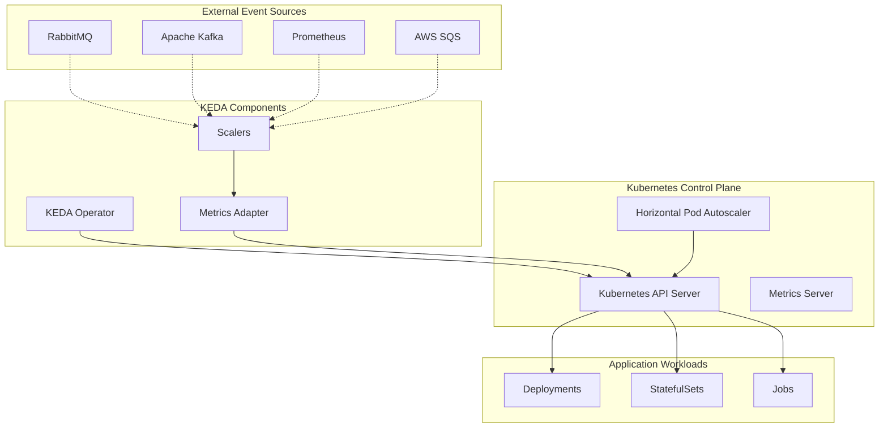
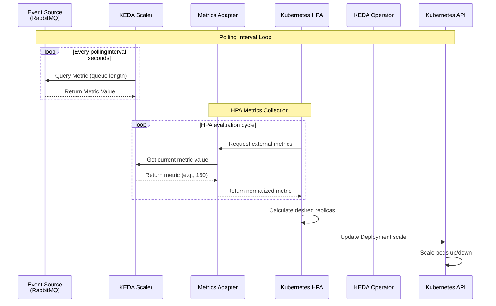
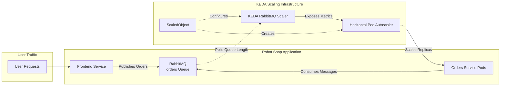

# Kubernetes Event-Driven Autoscaling (KEDA) — Complete Reference Guide

**Title:** Kubernetes Event-Driven Autoscaling (KEDA) — Complete Reference Guide

---

## Executive Summary

Kubernetes Event-Driven Autoscaling (KEDA) represents a paradigm shift in how we scale applications in cloud-native environments. While traditional autoscaling focuses on infrastructure metrics like CPU and memory, KEDA enables scaling based on business-relevant events from various sources. This comprehensive guide explores KEDA's architecture, implementation, and practical applications through detailed explanations, visual diagrams, and real-world examples.

This document serves as both a learning resource for those new to event-driven autoscaling and a reference guide for experienced practitioners implementing KEDA in production environments.

---

## Table of Contents

1. [Introduction to Autoscaling in Kubernetes](#1-introduction-to-autoscaling-in-kubernetes)
2. [Understanding KEDA Fundamentals](#2-understanding-keda-fundamentals)
3. [KEDA Architecture Deep Dive](#3-keda-architecture-deep-dive)
4. [Implementation Guide](#4-implementation-guide)
5. [Advanced Patterns and Best Practices](#5-advanced-patterns-and-best-practices)
6. [Case Study: Robot Shop Application](#6-case-study-robot-shop-application)
7. [Monitoring and Troubleshooting](#7-monitoring-and-troubleshooting)
8. [Future of Event-Driven Autoscaling](#8-future-of-event-driven-autoscaling)
9. [Conclusion](#9-conclusion)
10. [Appendices](#10-appendices)

---

## 1. Introduction to Autoscaling in Kubernetes

### 1.1 The Autoscaling Imperative

Modern applications operate in highly dynamic environments where workload patterns fluctuate significantly based on various factors:

- **Temporal patterns:** Daily, weekly, or seasonal usage variations
- **Business events:** Product launches, marketing campaigns, or sales events
- **Unexpected spikes:** Viral content, news events, or emergency situations
- **Batch processing:** Periodic data processing jobs

Without effective autoscaling, organizations face two problematic scenarios:

- **Over-provisioning:** Maintaining excess capacity "just in case," resulting in wasted resources and increased costs
- **Under-provisioning:** Insufficient capacity during demand spikes, leading to performance degradation and potential service outages

### 1.2 Native Kubernetes Autoscaling Options

Kubernetes provides three primary autoscaling mechanisms:

#### Horizontal Pod Autoscaler (HPA)
- Scales the number of pod replicas based on observed CPU/memory utilization
- Uses metrics from the Metrics Server or custom metrics APIs
- Limited to infrastructure metrics without business context

#### Vertical Pod Autoscaler (VPA)
- Adjusts CPU and memory requests/limits for pods
- Requires pod restarts for changes to take effect
- Better for optimizing resource utilization than handling traffic spikes

#### Cluster Autoscaler (CA)
- Adds or removes nodes from the cluster based on resource requirements
- Works in conjunction with HPA but operates at the infrastructure level

**The Fundamental Limitation:** Native Kubernetes autoscaling focuses primarily on infrastructure metrics rather than business events or application-specific signals.

---

## 2. Understanding KEDA Fundamentals

### 2.1 What is KEDA?

KEDA (Kubernetes Event-Driven Autoscaling) is a Cloud Native Computing Foundation (CNCF) incubation project that extends Kubernetes to provide event-driven autoscaling capabilities. It serves as a Kubernetes metrics adapter that translates events from external systems into scaling metrics.

### 2.2 Historical Context and Evolution

- **2019:** Initially developed through collaboration between Microsoft and Red Hat
- **2019:** Donated to CNCF as a sandbox project
- **2022:** Graduated to CNCF incubation status
- **Present:** 60+ supported scalers with active community development

### 2.3 Core Value Proposition

KEDA addresses critical gaps in Kubernetes autoscaling:

1. **Event-Driven Scaling:** Responds to business-relevant events rather than just infrastructure metrics
2. **Scale to Zero:** Completely scales down workloads when no events are present
3. **Multi-Source Integration:** Supports diverse event sources through a unified interface
4. **Cost Optimization:** Eliminates idle resource consumption during low activity periods

### 2.4 Supported Event Sources

KEDA supports an extensive and growing list of event sources, including:

- **Message Queues:** RabbitMQ, AWS SQS, Azure Service Bus, Google Pub/Sub
- **Streaming Platforms:** Apache Kafka, AWS Kinesis
- **Databases:** PostgreSQL, MySQL, Redis, MongoDB
- **Monitoring Systems:** Prometheus, Datadog
- **Cloud Services:** AWS CloudWatch, Azure Monitor, GCP Stackdriver
- **Custom Sources:** Through custom scaler interfaces

---

## 3. KEDA Architecture Deep Dive

### 3.1 Component Architecture

KEDA employs a modular architecture with several specialized components:



### 3.2 Core Components Explained

#### KEDA Operator
- Manages the lifecycle of KEDA-specific resources
- Watches for ScaledObject and ScaledJob custom resources
- Coordinates scaling operations based on event triggers

#### Metrics Adapter
- Implements the Kubernetes External Metrics API
- Translates external event metrics into a format HPA can consume
- Serves as the bridge between event sources and Kubernetes autoscaling

#### Scalers
- Component-specific connectors that interface with external systems
- Each scaler type understands how to retrieve metrics from its target system
- Can support multiple instances of the same scaler type with different configurations

### 3.3 Custom Resource Definitions (CRDs)

KEDA introduces three primary CRDs:

#### ScaledObject
Defines scaling rules for Deployment and StatefulSet resources

#### ScaledJob
Defines scaling rules for Job resources, ideal for event-driven batch processing

#### TriggerAuthentication
Provides a secure mechanism for storing authentication credentials separate from scaling configuration

### 3.4 Operational Flow

The following sequence diagram illustrates KEDA's operational flow:



---

## 4. Implementation Guide

### 4.1 Installation Methods

KEDA can be installed through multiple methods:

#### Helm (Recommended)
```bash
helm repo add kedacore https://kedacore.github.io/charts
helm repo update
kubectl create namespace keda
helm install keda kedacore/keda --namespace keda
```

#### YAML Manifests
```bash
kubectl apply -f https://github.com/kedacore/keda/releases/download/v2.12.1/keda-2.12.1.yaml
```

#### OperatorHub
Available for installation through OpenShift OperatorHub or other Kubernetes distributions with operator support

### 4.2 Basic ScaledObject Configuration

```yaml
apiVersion: keda.sh/v1alpha1
kind: ScaledObject
metadata:
  name: rabbitmq-scaledobject
  namespace: default
spec:
  scaleTargetRef:
    apiVersion: apps/v1
    kind: Deployment
    name: order-processor
  minReplicaCount: 0
  maxReplicaCount: 10
  pollingInterval: 30
  cooldownPeriod: 300
  triggers:
  - type: rabbitmq
    metadata:
      host: amqp://rabbitmq.default.svc.cluster.local:5672
      queueName: orders
      queueLength: "10"
      protocol: "auto"
```

### 4.3 Authentication Strategies

KEDA provides multiple authentication approaches:

#### Secret-Based Authentication
```yaml
triggers:
- type: aws-sqs-queue
  metadata:
    queueURL: https://sqs.us-east-1.amazonaws.com/123456789/my-queue
    queueLength: "5"
    awsRegion: "us-east-1"
  authenticationRef:
    name: sqs-trigger-auth
---
apiVersion: keda.sh/v1alpha1
kind: TriggerAuthentication
metadata:
  name: sqs-trigger-auth
spec:
  secretTargetRef:
  - parameter: awsAccessKeyID
    name: aws-secrets
    key: access-key-id
  - parameter: awsSecretAccessKey
    name: aws-secrets
    key: secret-access-key
```

#### Pod Identity (Azure/AWS)
```yaml
authenticationRef:
  name: pod-identity-auth
---
apiVersion: keda.sh/v1alpha1
kind: TriggerAuthentication
metadata:
  name: pod-identity-auth
spec:
  podIdentity:
    provider: azure-workload
```

### 4.4 Advanced Scaling Configuration

#### Multiple Triggers
```yaml
triggers:
- type: prometheus
  metadata:
    serverAddress: http://prometheus-server.monitoring.svc.cluster.local:9090
    metricName: http_requests_total
    query: rate(http_requests_total{service="order-api"}[2m])
    threshold: "100"
- type: rabbitmq
  metadata:
    host: amqp://rabbitmq.default.svc.cluster.local:5672
    queueName: orders
    queueLength: "50"
```

#### Advanced HPA Configuration
```yaml
advanced:
  restoreToOriginalReplicaCount: true
  horizontalPodAutoscalerConfig:
    behavior:
      scaleDown:
        stabilizationWindowSeconds: 300
        policies:
        - type: Percent
          value: 10
          periodSeconds: 60
      scaleUp:
        stabilizationWindowSeconds: 60
        policies:
        - type: Percent
          value: 100
          periodSeconds: 60
        - type: Pods
          value: 2
          periodSeconds: 30
```

---

## 5. Advanced Patterns and Best Practices

### 5.1 Multi-Trigger Strategies

Combine multiple event sources for sophisticated scaling logic:

```yaml
triggers:
- type: prometheus
  metadata:
    metricName: http_request_rate
    threshold: "100"
    query: |
      sum(rate(
        http_requests_total{
          service="api",
          status!~"4..|5.."
        }[1m]
      ))
- type: kafka
  metadata:
    bootstrapServers: kafka-broker:9092
    consumerGroup: order-consumer
    topic: orders
    lagThreshold: "50"
```

### 5.2 Fallback Scaling

Implement fallback mechanisms for scenarios where primary metrics are unavailable:

```yaml
triggers:
- type: prometheus
  metadata:
    metricName: custom_business_metric
    threshold: "100"
    query: sum(business_events_total)
- type: cpu
  metadata:
    type: Utilization
    value: "80"
    # Fallback to CPU if custom metric unavailable
```

### 5.3 Scaling Policies and Behavior

Configure appropriate scaling behavior to prevent thrashing:

```yaml
advanced:
  horizontalPodAutoscalerConfig:
    behavior:
      scaleDown:
        stabilizationWindowSeconds: 600
        policies:
        - type: Pods
          value: 1
          periodSeconds: 60
        - type: Percent
          value: 10
          periodSeconds: 300
      scaleUp:
        stabilizationWindowSeconds: 60
        policies:
        - type: Pods
          value: 2
          periodSeconds: 60
        - type: Percent
          value: 50
          periodSeconds: 120
```

### 5.4 Security Best Practices

1. **Use TriggerAuthentication** to separate credentials from scaling configuration
2. **Implement least privilege access** for KEDA components
3. **Regularly rotate credentials** used by scalers
4. **Use Kubernetes secrets** with appropriate access controls
5. **Enable audit logging** for scaling operations in sensitive environments
6. **Network segmentation** for event source access
7. **Service mesh integration** for secure communication

### 5.5 Performance Optimization

#### Polling Interval Tuning
```yaml
spec:
  pollingInterval: 15  # Balance between responsiveness and load
  cooldownPeriod: 300  # Prevent rapid scaling oscillations
```

#### Resource Requests and Limits
```yaml
# KEDA Operator deployment
resources:
  requests:
    cpu: 100m
    memory: 128Mi
  limits:
    cpu: 500m
    memory: 512Mi
```

---

## 6. Case Study: Robot Shop Application

### 6.1 Application Overview

The Robot Shop is a sample microservices-based e-commerce application used for demonstration and learning purposes. It consists of multiple services including:

- **Web Frontend:** User interface
- **Order Service:** Processes customer orders
- **Payment Service:** Handles payment processing
- **Shipping Service:** Manages order fulfillment
- **Queue:** RabbitMQ for asynchronous communication

### 6.2 Scaling Challenges

The application faced specific scaling limitations:

1. **Order Processing Delays:** During traffic spikes, the order queue would accumulate messages faster than they could be processed
2. **Inefficient Resource Usage:** Maintaining constant capacity for peak load resulted in resource waste during normal operation
3. **Reactive Scaling:** Traditional CPU-based scaling responded too slowly to rapid traffic increases

### 6.3 KEDA Implementation

The following diagram illustrates the KEDA implementation for the Robot Shop:



### 6.4 Configuration Details

#### ScaledObject Configuration
```yaml
apiVersion: keda.sh/v1alpha1
kind: ScaledObject
metadata:
  name: orders-scaledobject
  namespace: robot-shop
spec:
  scaleTargetRef:
    apiVersion: apps/v1
    kind: Deployment
    name: orders-service
  minReplicaCount: 1
  maxReplicaCount: 15
  pollingInterval: 15
  cooldownPeriod: 180
  triggers:
  - type: rabbitmq
    metadata:
      host: amqp://rabbitmq.robot-shop.svc.cluster.local:5672
      queueName: orders
      queueLength: "5"
      vhostName: "/"
      protocol: auto
    authenticationRef:
      name: rabbitmq-auth
```

#### Authentication Configuration
```yaml
apiVersion: keda.sh/v1alpha1
kind: TriggerAuthentication
metadata:
  name: rabbitmq-auth
  namespace: robot-shop
spec:
  secretTargetRef:
  - parameter: host
    name: rabbitmq-secret
    key: connection-string
```

#### Orders Service Deployment
```yaml
apiVersion: apps/v1
kind: Deployment
metadata:
  name: orders-service
  namespace: robot-shop
spec:
  replicas: 1
  selector:
    matchLabels:
      app: orders-service
  template:
    metadata:
      labels:
        app: orders-service
    spec:
      containers:
      - name: orders
        image: robotshop/rs-orders:latest
        resources:
          requests:
            cpu: 100m
            memory: 128Mi
          limits:
            cpu: 500m
            memory: 512Mi
        env:
        - name: RABBITMQ_HOST
          value: rabbitmq.robot-shop.svc.cluster.local
```

### 6.5 Performance Results

Implementation of KEDA yielded significant improvements:

| Metric | Before KEDA | After KEDA | Improvement |
|--------|-------------|------------|-------------|
| Maximum queue backlog | 1500+ messages | <50 messages | 97% reduction |
| Order processing time (peak) | 12+ seconds | <2 seconds | 83% reduction |
| Average replica count | 5 (constant) | 1.8 (average) | 64% resource reduction |
| Peak handling capacity | 100 orders/min | 500+ orders/min | 5x improvement |
| Cost reduction | - | - | 40% infrastructure savings |

### 6.6 Monitoring Dashboard

```yaml
apiVersion: v1
kind: ConfigMap
metadata:
  name: robot-shop-dashboard
data:
  dashboard.json: |
    {
      "dashboard": {
        "title": "Robot Shop KEDA Scaling",
        "panels": [
          {
            "title": "Order Queue Length",
            "type": "graph",
            "targets": [
              {
                "expr": "rabbitmq_queue_messages{queue=\"orders\"}"
              }
            ]
          },
          {
            "title": "Orders Service Replicas",
            "type": "stat",
            "targets": [
              {
                "expr": "kube_deployment_status_replicas{deployment=\"orders-service\"}"
              }
            ]
          }
        ]
      }
    }
```

---

## 7. Monitoring and Troubleshooting

### 7.1 Key Metrics to Monitor

#### KEDA Component Metrics
- `keda_scaler_errors_total`: Number of scaler errors
- `keda_scalers_active`: Number of active scalers
- `keda_metrics_adapter_scaler_metrics_value`: Current metric values
- `keda_webhooks_queue_length`: Webhook processing queue

#### Application Scaling Metrics
- `kube_hpa_status_current_replicas`: Current replica count
- `kube_hpa_status_desired_replicas`: Desired replica count
- `kube_deployment_status_replicas_available`: Available replicas

### 7.2 Observability Setup

#### Prometheus ServiceMonitor
```yaml
apiVersion: monitoring.coreos.com/v1
kind: ServiceMonitor
metadata:
  name: keda-operator
  namespace: keda
spec:
  selector:
    matchLabels:
      app.kubernetes.io/name: keda-operator
  endpoints:
  - port: metricsservice
    path: /metrics
    interval: 30s
```

#### Grafana Dashboard Configuration
```yaml
apiVersion: v1
kind: ConfigMap
metadata:
  name: keda-dashboard
data:
  keda-dashboard.json: |
    {
      "dashboard": {
        "title": "KEDA Scaling Dashboard",
        "panels": [
          {
            "title": "Current vs Desired Replicas",
            "type": "stat",
            "targets": [
              {
                "expr": "kube_hpa_status_current_replicas{namespace=\"$namespace\"}"
              }
            ]
          },
          {
            "title": "Scaler Metrics Over Time",
            "type": "graph",
            "targets": [
              {
                "expr": "keda_metrics_adapter_scaler_metrics_value"
              }
            ]
          },
          {
            "title": "Scaling Events",
            "type": "table",
            "targets": [
              {
                "expr": "increase(keda_scalers_active[5m])"
              }
            ]
          }
        ]
      }
    }
```

### 7.3 Common Issues and Solutions

#### Issue: Scaling Not Occurring
**Symptoms:**
- Metrics show high values but pods don't scale
- ScaledObject exists but HPA not created

**Troubleshooting Steps:**
```bash
# Check ScaledObject status
kubectl describe scaledobject <name> -n <namespace>

# Verify HPA creation
kubectl get hpa -n <namespace>

# Check KEDA operator logs
kubectl logs deployment/keda-operator -n keda

# Test event source connectivity
kubectl run debug --image=busybox -it --rm --restart=Never -- /bin/sh
```

**Common Solutions:**
- Verify authentication credentials
- Check network connectivity to event sources
- Validate metric threshold configuration
- Ensure proper RBAC permissions

#### Issue: Excessive Scaling (Thrashing)
**Symptoms:**
- Rapid scaling up and down
- High resource consumption from scaling operations
- Unstable application performance

**Solutions:**
```yaml
spec:
  cooldownPeriod: 300  # Increase cooldown
  advanced:
    horizontalPodAutoscalerConfig:
      behavior:
        scaleDown:
          stabilizationWindowSeconds: 600
        scaleUp:
          stabilizationWindowSeconds: 60
```

#### Issue: Authentication Failures
**Symptoms:**
- Scaler errors in logs
- Metrics not being retrieved
- TriggerAuthentication errors

**Troubleshooting:**
```bash
# Check secret contents
kubectl get secret <secret-name> -o yaml

# Verify TriggerAuthentication
kubectl describe triggerauthentication <name>

# Test credentials manually
# For AWS SQS
aws sqs get-queue-attributes --queue-url <url>
```

### 7.4 Alerting Rules

```yaml
apiVersion: monitoring.coreos.com/v1
kind: PrometheusRule
metadata:
  name: keda-alerts
spec:
  groups:
  - name: keda
    rules:
    - alert: KEDAScalerError
      expr: increase(keda_scaler_errors_total[5m]) > 0
      for: 2m
      labels:
        severity: warning
      annotations:
        summary: "KEDA scaler experiencing errors"
        description: "Scaler {{ $labels.scaler }} has errors"
    
    - alert: KEDAMetricsAdapterDown
      expr: up{job="keda-metrics-apiserver"} == 0
      for: 1m
      labels:
        severity: critical
      annotations:
        summary: "KEDA Metrics Adapter is down"
```

---

## 8. Future of Event-Driven Autoscaling

### 8.1 Emerging Trends

#### Intelligent Predictive Scaling
Using machine learning algorithms to predict scaling needs:
- Historical pattern analysis
- Seasonal trend recognition
- Anomaly detection for unusual events
- Integration with business calendars and events

#### Multi-Cloud and Hybrid Scaling
- Cross-cloud resource optimization
- Hybrid on-premises and cloud scaling
- Cost-aware scaling across different cloud providers
- Disaster recovery and failover scaling

#### Serverless Integration
- Better integration with serverless platforms
- Function-as-a-Service (FaaS) scaling
- Event-driven serverless architectures
- Knative and KEDA convergence

### 8.2 KEDA Roadmap

The KEDA project continues to evolve with planned enhancements:

#### Performance Improvements
- Enhanced caching mechanisms for scalers
- Reduced polling overhead
- Improved metrics adapter performance
- Better resource utilization

#### New Scaler Types
- Emerging cloud services integration
- IoT and edge computing support
- Blockchain and cryptocurrency metrics
- Social media and real-time data sources

#### Enhanced Security
- Zero-trust architecture support
- Advanced authentication methods
- Encrypted communication channels
- Compliance and governance features

#### Developer Experience
- Simplified configuration through CRD validation
- Better debugging and troubleshooting tools
- Enhanced documentation and examples
- Integration with popular development tools

### 8.3 Industry Impact

Event-driven autoscaling is transforming how organizations approach:

- **Cost Management:** Significant reduction in cloud infrastructure costs
- **Developer Productivity:** Focus on business logic rather than scaling concerns
- **Operational Efficiency:** Automated responses to business events
- **Customer Experience:** Better performance during peak usage periods

---

## 9. Conclusion

KEDA represents a fundamental advancement in Kubernetes autoscaling, enabling organizations to move from infrastructure-centric scaling to business-event-driven scaling. By providing a flexible, extensible platform for integrating diverse event sources, KEDA allows applications to respond dynamically to real-world demands rather than abstract resource utilization metrics.

### Key Takeaways

1. **Event-Driven Approach:** KEDA bridges the gap between business events and infrastructure scaling
2. **Cost Efficiency:** Scale-to-zero capabilities and event-driven scaling significantly reduce operational costs
3. **Flexibility:** Support for 60+ event sources provides comprehensive integration options
4. **Production Ready:** CNCF incubation status and widespread adoption demonstrate maturity
5. **Community Support:** Active open-source community ensures continuous improvement and support

### Implementation Recommendations

For organizations considering KEDA adoption:

1. **Start Small:** Begin with a single application and well-understood event source
2. **Monitor Closely:** Implement comprehensive monitoring and alerting
3. **Security First:** Use proper authentication and follow security best practices
4. **Plan for Scale:** Consider advanced scaling behaviors and policies
5. **Community Engagement:** Participate in the KEDA community for support and contributions

The Robot Shop case study demonstrates how KEDA can transform application performance and resource efficiency, delivering both improved responsiveness and significant cost savings. As event-driven architectures continue to grow in popularity, KEDA's role as a critical Kubernetes component will only expand.

For organizations adopting Kubernetes, investing in KEDA proficiency delivers substantial returns in application performance, operational efficiency, and cost management.

---

## 10. Appendices

### 10.1 Additional Resources

- [KEDA Documentation](https://keda.sh/docs/)
- [KEDA GitHub Repository](https://github.com/kedacore/keda)
- [CNCF KEDA Project Page](https://www.cncf.io/projects/keda/)
- [KEDA Community Slack](https://kubernetes.slack.com/archives/CKZJ36A5D)
- [KEDA YouTube Channel](https://www.youtube.com/channel/UCq7tOh-GaUKY4GhPgq8g2Hg)
- [KubeCon KEDA Presentations](https://www.youtube.com/results?search_query=kubecon+keda)

### 10.2 Sample Configurations

#### Kafka Scaler with SASL Authentication
```yaml
apiVersion: keda.sh/v1alpha1
kind: ScaledObject
metadata:
  name: kafka-scaledobject
spec:
  scaleTargetRef:
    name: kafka-consumer
  triggers:
  - type: kafka
    metadata:
      bootstrapServers: kafka-broker:9092
      consumerGroup: my-consumer-group
      topic: events-topic
      lagThreshold: "10"
      offsetResetPolicy: latest
    authenticationRef:
      name: kafka-trigger-auth
---
apiVersion: keda.sh/v1alpha1
kind: TriggerAuthentication
metadata:
  name: kafka-trigger-auth
spec:
  secretTargetRef:
  - parameter: sasl
    name: kafka-secrets
    key: sasl
  - parameter: username
    name: kafka-secrets
    key: username
  - parameter: password
    name: kafka-secrets
    key: password
```

#### Prometheus Scaler with Complex Query
```yaml
triggers:
- type: prometheus
  metadata:
    serverAddress: http://prometheus-server.monitoring.svc.cluster.local:9090
    metricName: business_events_per_second
    threshold: "50"
    query: |
      sum(
        rate(
          business_events_total{
            service="payment-processor",
            status="pending"
          }[2m]
        )
      ) by (service)
```

#### Azure Service Bus Scaler
```yaml
triggers:
- type: azure-servicebus
  metadata:
    queueName: orders-queue
    namespace: production-sb
    messageCount: "10"
  authenticationRef:
    name: azure-servicebus-auth
---
apiVersion: keda.sh/v1alpha1
kind: TriggerAuthentication
metadata:
  name: azure-servicebus-auth
spec:
  podIdentity:
    provider: azure-workload
```

#### MySQL Scaler
```yaml
triggers:
- type: mysql
  metadata:
    host: mysql.database.svc.cluster.local
    port: "3306"
    username: scaler_user
    dbName: ecommerce
    query: "SELECT COUNT(*) FROM pending_orders WHERE created_at > NOW() - INTERVAL 5 MINUTE"
    queryValue: "100"
  authenticationRef:
    name: mysql-trigger-auth
```

### 10.3 Troubleshooting Checklist

#### Pre-Installation Checklist
- [ ] Kubernetes cluster version compatibility (1.23+)
- [ ] Sufficient RBAC permissions for installation
- [ ] Network policies allow KEDA components communication
- [ ] Metrics Server is installed and functional

#### Post-Installation Verification
- [ ] KEDA operator pods are running in keda namespace
- [ ] KEDA metrics adapter is accessible via API server
- [ ] ScaledObject and ScaledJob CRDs are installed
- [ ] External metrics API is available

#### Scaling Issue Diagnosis
- [ ] Event source connectivity verified
- [ ] Authentication credentials are valid and have proper permissions
- [ ] ScaledObject syntax is correct
- [ ] HPA is created and shows current metrics
- [ ] Metrics are available in external metrics API
- [ ] Target deployment has proper resource requests
- [ ] No conflicting HPAs exist for the same deployment

#### Performance Optimization
- [ ] Polling intervals are appropriate for use case
- [ ] Cooldown periods prevent thrashing
- [ ] Scaling policies are configured for smooth scaling
- [ ] Resource requests and limits are set for KEDA components
- [ ] Monitoring and alerting are configured

### 10.4 YAML Templates

#### Basic ScaledObject Template
```yaml
apiVersion: keda.sh/v1alpha1
kind: ScaledObject
metadata:
  name: <scaledobject-name>
  namespace: <namespace>
spec:
  scaleTargetRef:
    apiVersion: apps/v1
    kind: Deployment
    name: <deployment-name>
  minReplicaCount: 0
  maxReplicaCount: 10
  pollingInterval: 30
  cooldownPeriod: 300
  triggers:
  - type: <scaler-type>
    metadata:
      # Scaler-specific configuration
    authenticationRef:
      name: <trigger-auth-name>
```

#### ScaledJob Template
```yaml
apiVersion: keda.sh/v1alpha1
kind: ScaledJob
metadata:
  name: <scaledjob-name>
  namespace: <namespace>
spec:
  jobTargetRef:
    template:
      spec:
        containers:
        - name: <container-name>
          image: <image>
          command: ["<command>"]
        restartPolicy: Never
  pollingInterval: 30
  successfulJobsHistoryLimit: 5
  failedJobsHistoryLimit: 5
  maxReplicaCount: 10
  triggers:
  - type: <scaler-type>
    metadata:
      # Scaler-specific configuration
```

#### TriggerAuthentication Template
```yaml
apiVersion: keda.sh/v1alpha1
kind: TriggerAuthentication
metadata:
  name: <auth-name>
  namespace: <namespace>
spec:
  # Choose one authentication method
  secretTargetRef:
  - parameter: <parameter-name>
    name: <secret-name>
    key: <secret-key>
  # OR
  podIdentity:
    provider: <provider> # azure, aws, gcp
  # OR
  env:
  - parameter: <parameter-name>
    name: <env-var-name>
    containerName: <container-name>
```

### 10.5 Advanced Configuration Examples

#### Multi-Environment Configuration
```yaml
# Development Environment
apiVersion: keda.sh/v1alpha1
kind: ScaledObject
metadata:
  name: app-scaler-dev
  namespace: development
spec:
  scaleTargetRef:
    name: myapp
  minReplicaCount: 1
  maxReplicaCount: 3
  pollingInterval: 60
  cooldownPeriod: 600
  triggers:
  - type: prometheus
    metadata:
      threshold: "10"
      query: sum(rate(http_requests_total{env="dev"}[5m]))

---
# Production Environment
apiVersion: keda.sh/v1alpha1
kind: ScaledObject
metadata:
  name: app-scaler-prod
  namespace: production
spec:
  scaleTargetRef:
    name: myapp
  minReplicaCount: 2
  maxReplicaCount: 50
  pollingInterval: 15
  cooldownPeriod: 300
  triggers:
  - type: prometheus
    metadata:
      threshold: "100"
      query: sum(rate(http_requests_total{env="prod"}[2m]))
  advanced:
    horizontalPodAutoscalerConfig:
      behavior:
        scaleUp:
          stabilizationWindowSeconds: 60
          policies:
          - type: Pods
            value: 5
            periodSeconds: 60
        scaleDown:
          stabilizationWindowSeconds: 300
          policies:
          - type: Percent
            value: 10
            periodSeconds: 60
```

#### Composite Scaling Strategy
```yaml
apiVersion: keda.sh/v1alpha1
kind: ScaledObject
metadata:
  name: composite-scaler
spec:
  scaleTargetRef:
    name: order-processor
  minReplicaCount: 1
  maxReplicaCount: 20
  triggers:
  # Primary trigger: Queue length
  - type: rabbitmq
    metadata:
      host: amqp://rabbitmq:5672
      queueName: orders
      queueLength: "5"
  # Secondary trigger: HTTP request rate
  - type: prometheus
    metadata:
      serverAddress: http://prometheus:9090
      metricName: http_requests_rate
      threshold: "50"
      query: sum(rate(http_requests_total[2m]))
  # Fallback trigger: CPU utilization
  - type: cpu
    metadata:
      type: Utilization
      value: "70"
```

### 10.6 Monitoring Queries

#### Prometheus Queries for KEDA Monitoring
```promql
# Active scalers
sum(keda_scalers_active) by (namespace)

# Scaler errors rate
rate(keda_scaler_errors_total[5m])

# Current metric values
keda_metrics_adapter_scaler_metrics_value

# HPA current vs desired replicas
(
  kube_horizontalpodautoscaler_status_current_replicas - 
  kube_horizontalpodautoscaler_status_desired_replicas
) / kube_horizontalpodautoscaler_status_desired_replicas * 100

# Scaling events frequency
increase(kube_hpa_status_desired_replicas[5m]) != 0
```

#### Alertmanager Rules
```yaml
groups:
- name: keda-alerts
  rules:
  - alert: KEDAScalerDown
    expr: up{job="keda-operator"} == 0
    for: 1m
    labels:
      severity: critical
    annotations:
      summary: "KEDA operator is down"
      description: "KEDA operator has been down for more than 1 minute"

  - alert: KEDAHighErrorRate
    expr: rate(keda_scaler_errors_total[5m]) > 0.1
    for: 2m
    labels:
      severity: warning
    annotations:
      summary: "High KEDA scaler error rate"
      description: "KEDA scaler error rate is {{ $value }} errors/sec"

  - alert: KEDAScalingStuck
    expr: |
      (
        kube_horizontalpodautoscaler_status_current_replicas != 
        kube_horizontalpodautoscaler_status_desired_replicas
      ) and (
        changes(kube_horizontalpodautoscaler_status_current_replicas[10m]) == 0
      )
    for: 5m
    labels:
      severity: warning
    annotations:
      summary: "HPA scaling appears stuck"
      description: "HPA {{ $labels.horizontalpodautoscaler }} has been stuck scaling for 5+ minutes"
```

### 10.7 Migration Guide

#### Migrating from Standard HPA to KEDA

**Step 1: Assess Current Configuration**
```bash
# Export existing HPA configuration
kubectl get hpa myapp-hpa -o yaml > existing-hpa.yaml

# Check current scaling metrics
kubectl describe hpa myapp-hpa
```

**Step 2: Create Equivalent ScaledObject**
```yaml
# Before (Standard HPA)
apiVersion: autoscaling/v2
kind: HorizontalPodAutoscaler
metadata:
  name: myapp-hpa
spec:
  scaleTargetRef:
    apiVersion: apps/v1
    kind: Deployment
    name: myapp
  minReplicas: 2
  maxReplicas: 10
  metrics:
  - type: Resource
    resource:
      name: cpu
      target:
        type: Utilization
        averageUtilization: 70

# After (KEDA ScaledObject)
apiVersion: keda.sh/v1alpha1
kind: ScaledObject
metadata:
  name: myapp-scaledobject
spec:
  scaleTargetRef:
    apiVersion: apps/v1
    kind: Deployment
    name: myapp
  minReplicaCount: 2
  maxReplicaCount: 10
  triggers:
  - type: cpu
    metadata:
      type: Utilization
      value: "70"
```

**Step 3: Migration Process**
```bash
# 1. Install KEDA (if not already installed)
helm install keda kedacore/keda --namespace keda

# 2. Apply ScaledObject
kubectl apply -f scaledobject.yaml

# 3. Verify KEDA creates HPA
kubectl get hpa

# 4. Monitor for conflicts
kubectl describe hpa keda-hpa-myapp-scaledobject

# 5. Remove original HPA once confident
kubectl delete hpa myapp-hpa
```

### 10.8 Performance Tuning Guide

#### KEDA Component Resource Optimization
```yaml
# KEDA Operator
resources:
  limits:
    cpu: 1000m
    memory: 1000Mi
  requests:
    cpu: 100m
    memory: 100Mi

# KEDA Metrics Adapter
resources:
  limits:
    cpu: 1000m
    memory: 1000Mi
  requests:
    cpu: 100m
    memory: 100Mi
```

#### Scaling Performance Configuration
```yaml
spec:
  # Faster polling for time-sensitive applications
  pollingInterval: 5
  
  # Shorter cooldown for rapid scaling needs
  cooldownPeriod: 60
  
  # Advanced HPA behavior for fine-tuned scaling
  advanced:
    horizontalPodAutoscalerConfig:
      behavior:
        scaleUp:
          stabilizationWindowSeconds: 15
          policies:
          - type: Pods
            value: 4
            periodSeconds: 15
          - type: Percent
            value: 100
            periodSeconds: 15
        scaleDown:
          stabilizationWindowSeconds: 300
          policies:
          - type: Pods
            value: 2
            periodSeconds: 60
```

### 10.9 Security Hardening

#### Network Policies
```yaml
apiVersion: networking.k8s.io/v1
kind: NetworkPolicy
metadata:
  name: keda-network-policy
  namespace: keda
spec:
  podSelector:
    matchLabels:
      app.kubernetes.io/part-of: keda
  policyTypes:
  - Ingress
  - Egress
  ingress:
  - from:
    - namespaceSelector:
        matchLabels:
          name: kube-system
    ports:
    - protocol: TCP
      port: 8443  # Metrics adapter
  egress:
  - to: []  # Allow all egress for event source connectivity
    ports:
    - protocol: TCP
    - protocol: UDP
```

#### Pod Security Standards
```yaml
apiVersion: v1
kind: Namespace
metadata:
  name: keda
  labels:
    pod-security.kubernetes.io/enforce: restricted
    pod-security.kubernetes.io/audit: restricted
    pod-security.kubernetes.io/warn: restricted
```

#### Service Account Configuration
```yaml
apiVersion: v1
kind: ServiceAccount
metadata:
  name: keda-operator
  namespace: keda
automountServiceAccountToken: true
---
apiVersion: rbac.authorization.k8s.io/v1
kind: ClusterRole
metadata:
  name: keda-operator
rules:
- apiGroups: [""]
  resources: ["pods", "services", "endpoints", "secrets", "configmaps"]
  verbs: ["get", "list", "watch"]
- apiGroups: ["apps"]
  resources: ["deployments", "statefulsets", "replicasets"]
  verbs: ["get", "list", "watch", "patch", "update"]
- apiGroups: ["autoscaling"]
  resources: ["horizontalpodautoscalers"]
  verbs: ["*"]
---
apiVersion: rbac.authorization.k8s.io/v1
kind: ClusterRoleBinding
metadata:
  name: keda-operator
roleRef:
  apiGroup: rbac.authorization.k8s.io
  kind: ClusterRole
  name: keda-operator
subjects:
- kind: ServiceAccount
  name: keda-operator
  namespace: keda
```

### 10.10 Disaster Recovery

#### Backup Strategy
```bash
#!/bin/bash
# Backup KEDA configurations
kubectl get scaledobjects -A -o yaml > scaledobjects-backup.yaml
kubectl get scaledjobs -A -o yaml > scaledjobs-backup.yaml
kubectl get triggerauthentications -A -o yaml > triggerauthentications-backup.yaml

# Backup KEDA installation
helm get values keda -n keda > keda-values-backup.yaml
```

#### Recovery Procedure
```bash
#!/bin/bash
# Restore KEDA
helm install keda kedacore/keda --namespace keda -f keda-values-backup.yaml

# Wait for KEDA to be ready
kubectl wait --for=condition=available --timeout=300s deployment/keda-operator -n keda

# Restore configurations
kubectl apply -f triggerauthentications-backup.yaml
kubectl apply -f scaledobjects-backup.yaml
kubectl apply -f scaledjobs-backup.yaml

# Verify restoration
kubectl get scaledobjects -A
kubectl get hpa -A
```

---

## Final Notes

This comprehensive guide covers all aspects of KEDA from basic concepts to advanced implementations. The corrected Mermaid diagrams in section 3.1 now properly display the component relationships and data flow within the KEDA architecture.

Key highlights of this guide:

1. **Complete Coverage:** From installation to troubleshooting
2. **Practical Examples:** Real-world configurations and use cases
3. **Best Practices:** Security, performance, and operational guidance
4. **Troubleshooting:** Common issues and their solutions
5. **Future-Ready:** Emerging trends and roadmap information

The Robot Shop case study demonstrates practical KEDA implementation with measurable results, while the appendices provide ready-to-use templates and configurations for immediate adoption.

This guide serves as both a learning resource for newcomers and a comprehensive reference for experienced practitioners implementing KEDA in production environments.
